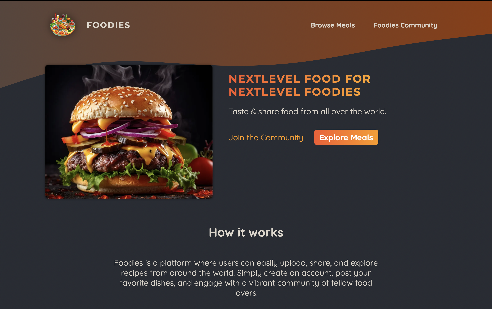
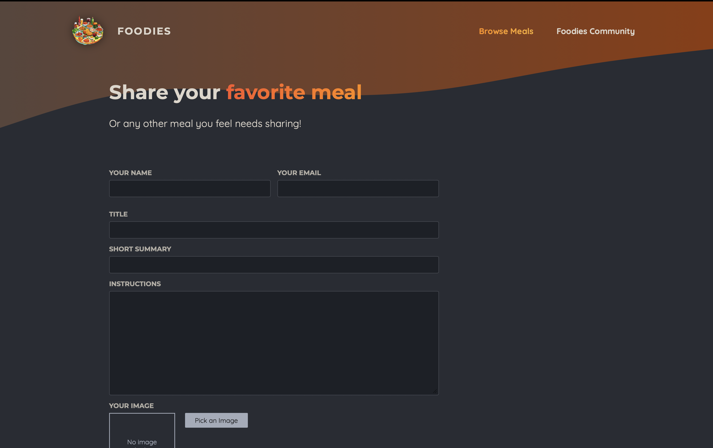

# 🍽️ Foodies — Share Your Signature Recipes  
A community-driven recipe-sharing platform built with **Next.js** and a **local SQLite backend**.  
Users can upload their signature dishes, images, ingredients, steps, and help others try and enjoy new food creations!

<p align="center">
  
</p>
<p align="center">
  
</p>
<p align="center">
  
</p>

---

## ⭐ Features
- 📸 Upload dish images  
- 🥘 Add ingredients, steps & cooking instructions  
- 🔍 Browse recipes shared by the community  
- ⚡ Local backend using **SQLite** (no external DB needed)  
- 🧭 Clean UX powered by **Next.js**  
- 📱 Fully responsive UI  

---

## 🚀 Setup & Run (Single Command Block)

```bash
# Clone the repository
git clone https://github.com/NikhilG6704/foodies.git
cd foodies

# Install dependencies
npm install   # or yarn

# Start the development server (auto-creates SQLite DB)
npm run dev   # or yarn dev

# App runs at:
# 👉 http://localhost:3000
